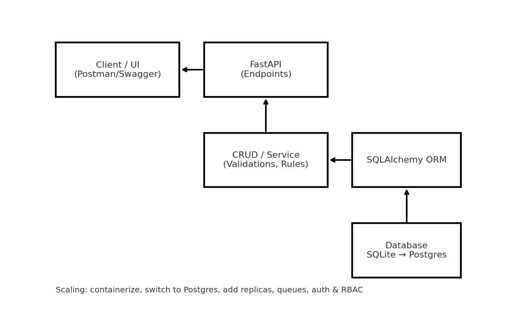

# Mini Leave Management System — Python (FastAPI)

This is a minimal Leave Management System implementing your assessment requirements. It mirrors the GitHub reference you shared, but in Python with FastAPI + SQLite.

## Features
- Add employees (name, email, department, joining date, annual allowance)
- Apply for leave
- Approve/Reject leave
- Fetch leave balance
- List leaves by status
- Validations and edge-case handling

## Tech
- FastAPI, SQLAlchemy, SQLite
- Auto docs at `/docs` and `/redoc` when running locally

## Quick Start
```bash
python -m venv .venv && source .venv/bin/activate  # Windows: .venv\Scripts\activate
pip install -r requirements.txt
uvicorn app.main:app --reload
```
Open: http://127.0.0.1:8000/docs
Open: http://127.0.0.1:8000/redoc

## API Summary
- `POST /employees` — add employee
- `GET /employees/{id}` — get employee
- `GET /employees/{id}/balance` — remaining balance
- `POST /leaves` — apply for leave
- `POST /leaves/{id}/decision` — approve/reject (`{ "approve": true|false }`)
- `GET /leaves?status=pending|approved|rejected` — list leaves

See `sample_requests.http` for ready-to-run examples (VS Code REST Client).

## Edge Cases Covered
- Employee not found — 404
- Invalid dates (start > end) — 400
- Applying before joining date — 400
- Overlapping pending/approved requests — 400
- Insufficient balance on apply **and** on approve — 400
- Duplicate email on employee create — 400
- Guard against excessively long single leave (MVP: > 60 days) — 400

## Assumptions
- Annual allowance defaults to 24 days; counts calendar days (inclusive). (Can be swapped to business days)
- Only *annual* leaves consume allowance; other types are tracked but not deducted in MVP.
- Overlap check blocks conflicts with both approved and pending requests for the same employee.
- No authentication in the MVP (can be added with OAuth/JWT).

## High Level Design (HLD)


**Flow:** UI/Client → FastAPI → CRUD/Service → SQLAlchemy → SQLite. Balance is derived from approved leaves. Scaling notes:
- Move from SQLite → Postgres/MySQL
- Add read replicas and a job queue for heavy calculations
- Introduce auth service & RBAC for HR vs employee actions
- Use containerization (Docker) and a PaaS (Render/Heroku) for deployment

## Project Layout
```
app/
  main.py         # FastAPI endpoints
  database.py     # DB engine/session
  models.py       # ORM models
  schemas.py      # Pydantic schemas
  crud.py         # business logic
  utils.py        # helpers
docs/
  HLD.png
provided_assets/  # copied from your uploaded ZIP for reference/history
sample_requests.http
requirements.txt
README.md
```

## Potential Improvements
- Working days/holidays calendar & half-day support
- Accrual policy, carry-forward, and encashment
- Attachments & leave cancellation
- Email/Slack notifications on approvals
- Admin UI (React) + role-based permissions
- Unit tests & CI pipeline

## Deployment (Render example)
- Create a new Web Service, build with `pip install -r requirements.txt`
- Start command: `uvicorn app.main:app --host 0.0.0.0 --port 10000`
- Add a persistent DB (e.g., Postgres) and set the URL in `database.py`

---

**Assessment Mapping:** This repository covers Part 1 (APIs) and Part 2 (HLD + scaling). ReadMe includes setup, assumptions, edge cases, and improvements. Screenshots can be added from Swagger UI after running locally.
